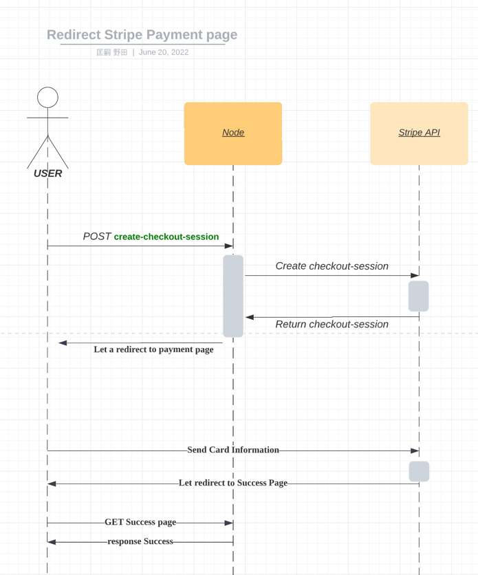

# Take home project
This is a simple e-commerce application that a customer can use to purchase a book, but it's missing the payments functionality —  your goal is to integrate Stripe to get this application running!

## Candidate instructions
You'll receive these in email.

## Application overview
This demo is written in Javascript (Node.js) with the [Express framework](https://expressjs.com/). You'll need to retrieve a set of testmode API keys from the Stripe dashboard (you can create a free test account [here](https://dashboard.stripe.com/register)) to run this locally.

We're using the [Bootstrap](https://getbootstrap.com/docs/4.6/getting-started/introduction/) CSS framework. It's the most popular CSS framework in the world and is pretty easy to get started with — feel free to modify styles/layout if you like. 

To simplify this project, we're also not using any database here, either. Instead `app.js` includes a simple switch statement to read the GET params for `item`. 

To get started, clone the repository and run `npm install` to install dependencies:

```
git clone https://github.com/mattmitchell6/sa-takehome-project-node && cd sa-takehome-project-node
npm install
```

Rename `sample.env` to `.env` and populate with your Stripe account's test API keys

Then run the application locally:

```
npm start
```

Navigate to [http://localhost:3000](http://localhost:3000) to view the index page.

## Test card number for credit card payment
Test Card Number : 4242 4242 4242 4242

Expire Date : Future date from now

# My Comments and answers for Demo Samples

## A paragraph or two about your solution: how does it work? Which Stripe APIs does it use?
By redirecting customers to Stripe's payment page, the service provider retains the customer's card number and reduces the costs required for security management.
Also, since Stripe provides other payment functions including credit card and QR code payment, it can provide a high UX service with less development time.


## A paragraph or two about how you approached this problem: which docs did you use to complete the project? What challenges did you encounter?
### 1 Read the Stripe Document, API doc also
### 2 Check the Stripe GitHub
### * I also prepared using the checkout.js version

I referred to Stripe Document.
https://stripe.com/docs/checkout/quickstart

## A paragraph or two about how you might extend this if you were building a more robust instance of the same application.

### 1 To Make Node.js redundant. For instance, use cluster of Node.js process.
### 2 To make the cart persistence
#### Cart persistence to allow another server to take over if the Node process goes down in the middle of the process.


## Sequence
